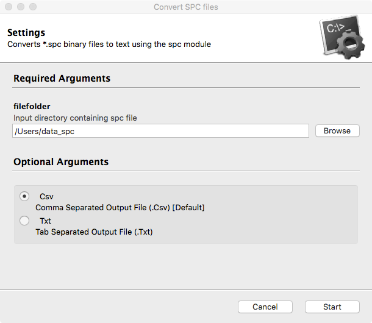

# spc
A module for working with .SPC files in Python. SPC is a binary data format to store a variety of spectral data, developed by Galactic Industries Corporation in the '90s. Popularly used  Thermo Fisher/Scientific software  GRAMS/AI. Also used by others including Ocean Optics, Jobin Yvon Horiba. Can store a variety of spectrum including FT-IR, UV-VIS, X-ray Diffraction, Mass Spectroscopy, NMR, Raman and Fluorescence spectra.

The SPC file format can store either single or multiple y-values, and the x-values can either be given explicitly or even spaced x-values can be generated based on initial and final points as well as number of points. In addition the format can store various log data and parameters, as well as various information such as axis labels and scan type.

Based mainly on the Thermo Scientific SPC File SDK [1]

## File versions supported

File versions are given by the second bit in the file, `fversn` in an SPC object.
Currently the library supports the following `fversn` bytes.

| fversn | Description      | Support      | Notes                                                                                              |
|--------|------------------|--------------|----------------------------------------------------------------------------------------------------|
| 0x4B   | New format (LSB) | Good         | z-values are not accounted for in data_txt() and plot() commands |
| 0x4C   | New format (MSB) | None         | need sample file to test                                                                           |
| 0x4D   | Old format       | Good      |                                                                                                    |
| 0xCF   | SHIMADZU format  | Very limited | no metadata support, only tested on one file, no specifications                                    |

## Object format

```python
>>> import spc
>>> f = spc.File('/Desktop/sample.spc')
x-y(20)  # format string
```

| format string | x-values                  | y-values                  |
|---------------|---------------------------|---------------------------|
| -xy(n)        | f.sub[0].x ... f.sub[n].x | f.sub[0].y ... f.sub[n].y |
| x-y(n)        | f.x                       | f.sub[0].y ... f.sub[n].y |
| gx-y(n)       | f.x (generated)           | f.sub[0].y ... f.sub[n].y |

| metadata            | variable        |
|---------------------|-----------------|
| x-label             | f.xlabel        |
| y-label             | f.ylabel        |
| z-label             | f.zlabel        |
| Comment (formatted) | f.cmnt          |
| Comment (raw)       | f.fcmnt         |
| Experiment type     | f.exp_type      |
| Log dictionay       | f.log_dict      |
| Log (remaining)     | f.log_other     |

| Functions      |
|----------------|
| f.output_txt() |
| f.debug_info() |
| f.plot()       |
| f.write_file() |

## File converter

### CLI: convert.py

```
$ python convert.py --help
usage: convert.py [-h] [-c | -t] filefolder [filefolder ...]

Converts *.spc binary files to text using the spc module

positional arguments:
  filefolder  Input *.spc files or directory

optional arguments:
  -h, --help  show this help message and exit
  -c, --csv   Comma separated output file (.csv) [default]
  -t, --txt   Tab separated output file (.txt)
```

#### Examples

	Convert file1.spc and file2.spc to file1.txt and file2.txt (tab delimited)
	$ python convert.py file1.spc file2.spc -t
	Convert the spc files in spc_dir to .csv files
	$ python convert.py spc_dir

### GUI: convert_gui.py

Requires [wxPython](http://www.wxpython.org/download.php) and [Gooey](https://github.com/chriskiehl/Gooey) (`pip install gooey`)

Only works on a single folder at a time.




## General use

```python
# import file to python object
import spc
f = spc.File('/path/to/file.spc')
f.debug_info() 	# extract info from header metadata
f.output_txt()  # output file data as columns
f.plot()  # plot using matplotlib
f.__dict__  # view all object contents
```

## Features
1. Extracts header information into object members
2. For each subfile, extract subfile data into `subFile` class objects `sub[0]` (, `sub[1]`, `sub[2]`, ...)
3. Extract x and y values into numpy `ndarray`
3. Attempts to interpret x,y, and z labels, as well as scan type
4. Member functions to output data in text, or plot using `matplotlib`

### Dependencies
- numpy
- matplotlib (for plotting)

### Notes
+ Used format specification [1]
+ Loads entire file into memory
+ Data uses variable naming as in SPC.H

### Todo
+ ~~Use flag for 16bit and test~~
+ Check struct string (`<` vs others, using signed vs. unsigned ints)
+ Remove repetitions in sub class
+ Remove multiple definitions of flag bits
+ Better debug info that works all the time
+ Year info for old data
+ ~~Fix exponent in 16 bit format~~
+ Add labels to ~~plots and~~ text output
+ Merge both subFile classes, they are pretty similar

## References
[1] "Thermo Scientific SPC File Format." Thermo Fisher Scientific, Web. 20 July 2014. <http://ftirsearch.com/features/converters/SPCFileFormat.htm>.
